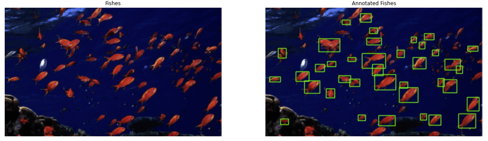

# Automated annotation tools

This project is about automated annotation tools, which are used to label objects in images for the purpose of training machine learning models.

# Why? 
Automatic annotation is important because it allows for the efficient and accurate labeling of large amounts of data, which is a crucial step in training machine learning models. Without accurate and comprehensive labels, machine learning models cannot learn to identify objects and patterns in data. Automated annotation tools can help to reduce the time and effort required to label data, allowing for more efficient and effective training of machine learning models. This can ultimately lead to more accurate and reliable machine learning models.

# How?
We can do it using threshold, morph operations and detecting contours!

The project includes a Jupyter notebook that explains all the important concepts and provides examples of how to use the tools. It was programmed on a google colab notebook. 

You can find the public [google colab here!](https://colab.research.google.com/drive/191A0oC_WlhA27thnDWXthcQNK20XXyhV?usp=sharing)

# Bibliography 
The tools are based on [this OpenCV tutorial post](https://pip.pypa.io/en/stable/).
